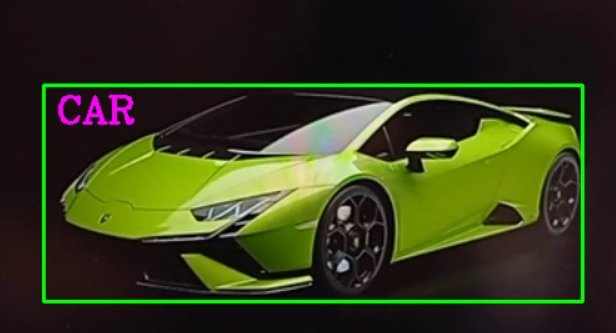
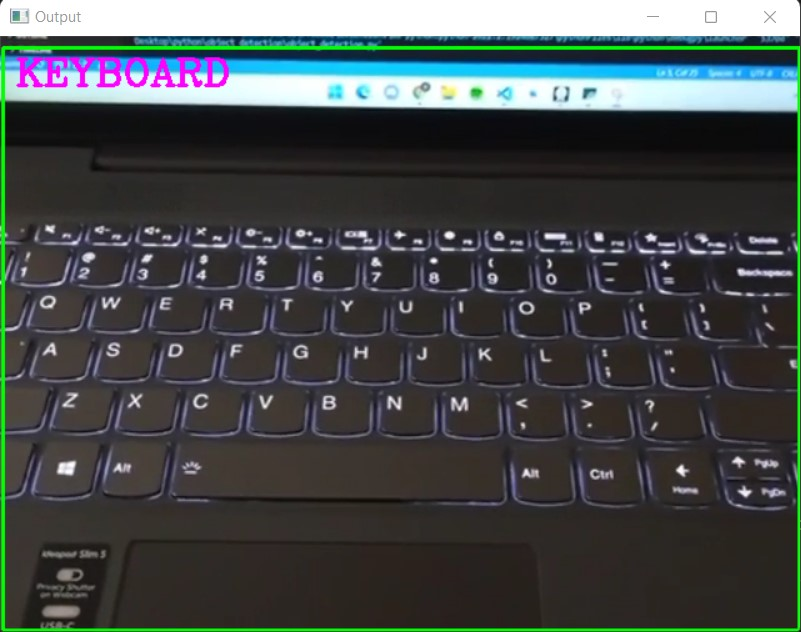
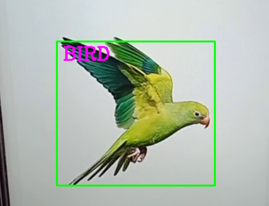
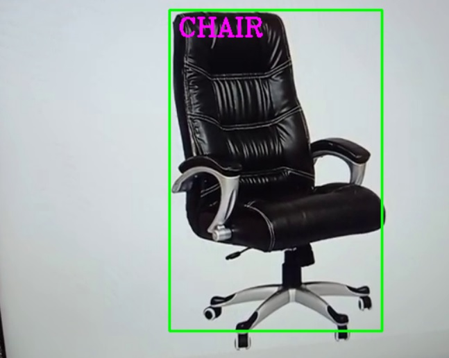

# Object-Detection

### This is a project which can detect and recognize object through computer vision technique for locating instances of objects in images or videos.
### Using OpenCV we can recognize diffrent kinds of thing from vechiles,animals,electronic gadget,etc

Working Screenshot
-------
| Car recognization        | Keyboard recognization          | 
| ------------- | ---------|
|      | |
| Bird recognization        | Chair recognization          |
| ------------- | ---------|
|      | |

### Recognition takes place above 50% confidence level 

